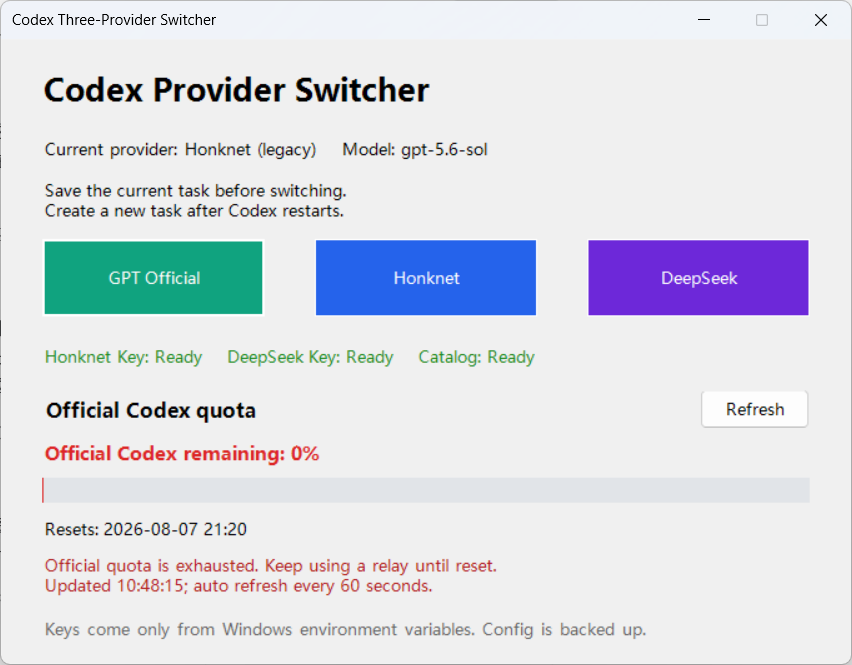

# Codex Three-Provider Switcher

一个面向 Windows Codex Desktop 的三线路切换器，可在以下 provider 之间切换：

| 按钮 | Provider | 默认模型 | 凭据来源 |
| --- | --- | --- | --- |
| GPT Official | OpenAI 官方账号 | `gpt-5.6-sol` | Codex 已登录的 OpenAI/ChatGPT 账号 |
| Honknet | Honknet Responses API | `gpt-5.6-sol` | `HONKNET_API_KEY` 用户环境变量 |
| DeepSeek | DeepSeek Responses API | `deepseek-v4-flash` | `DEEPSEEK_API_KEY` 用户环境变量 |

> 这是非官方社区工具。它不会提供、共享或代购任何 API Key，也不会绕过供应商的账号、额度或使用限制。

## 最终效果



界面会显示当前 provider、模型、两个第三方 Key 的配置状态以及 DeepSeek 模型目录状态。截图中的 `Ready` 只表示对应配置在本机可用，不包含或展示任何真实 Key。

## 为什么需要这个工具

这个项目解决的核心问题不是“管理 Codex 登录账号”，而是明确控制 Codex Desktop 下一次启动时使用的 provider 和模型线路。

### 1. 解决中转工具残留导致无法切回官方线路

部分用户长期使用 CC Switch、Codex 路由工具或其他脚本配置中转 API。这些工具可能在 `%USERPROFILE%\.codex\config.toml` 中留下：

- 顶层 `model_provider` 仍指向 `custom` 或其他第三方 provider。
- 第三方 `base_url`、模型目录和 bearer token 配置继续生效。
- 多个工具反复改写同一份配置，导致字段重复、配置错乱或状态难以判断。

后续即使订阅了 Codex 官方账号并完成 OpenAI/ChatGPT 登录，客户端仍可能继续使用原来的中转 provider，看起来像是“官方账号无法登录”或“登录后没有切回官方模型”。这是因为账号授权状态和模型路由配置是两套独立状态：登录成功并不会自动清除第三方 `model_provider`。

本工具在保留官方登录状态、MCP、插件和权限配置的前提下，明确重写顶层 provider/model 路由，并在切换前自动备份，从而稳定切回 GPT Official。

### 2. 官方 Codex 额度不足时快速切换到中转 API

当官方账号额度不足、暂时受限或需要使用其他模型时，可以一键切换到 Honknet 或 DeepSeek 线路，继续通过 Codex Desktop 工作。官方额度恢复后，再点击 `GPT Official` 切回，原有 OpenAI/ChatGPT 登录状态仍然保留。

本项目会读取已登录官方账号返回的 Codex 限额数据，用于显示剩余百分比和重置时间；线路切换仍然是人工一键操作，不会自动在后台更改 provider。切换后必须重启客户端并新建任务，才能明确验证新的线路。

> 不建议让 CC Switch、其他 provider 管理工具和本项目同时改写同一个 `config.toml`。确定使用本项目后，应由一个工具统一管理线路，避免配置再次相互覆盖。

## 它会做什么

- 提供一个包含三个按钮的 Windows 桌面窗口。
- 切换前自动备份 `%USERPROFILE%\.codex\config.toml`。
- 只替换顶层模型路由设置，并维护自己的 provider table。
- 保留现有的插件、MCP、权限、features、projects 等其他配置。
- 从 Windows 环境变量读取第三方 Key，不把 Key 写入仓库或 TOML。
- 显示官方 Codex 剩余量、重置时间，并在窗口打开期间每 60 秒自动刷新。
- 切换后重启 Codex Desktop；已有任务不会改变 provider，需要新建任务。

## 系统要求

- Windows 11。
- Microsoft Store 版 Codex Desktop。
- Windows PowerShell 5.1 或 PowerShell 7。
- 已至少启动并登录过一次 Codex Desktop，使下列文件存在：

```text
%USERPROFILE%\.codex\config.toml
%USERPROFILE%\.codex\auth.json
```

- Honknet 和 DeepSeek 线路需要你自己合法取得的 API Key。
- 第三方服务端必须支持 Codex 使用的 Responses API。只支持 `chat/completions` 的接口不能直接使用本项目默认配置。
- 官方额度显示需要 Node.js 和 npm 版 `@openai/codex` CLI；未安装时三路切换仍可使用，只有额度区域显示 `Unavailable`。

检查 Codex CLI：

```powershell
codex --version
```

需要安装或更新时：

```powershell
npm install -g @openai/codex
```

## 重要安全提醒

不要把真实 API Key 填进以下文件：

- `providers.json`
- `config.toml`
- `README.md`
- CMD、PowerShell 脚本或 Git 提交

安装程序通过隐藏输入读取 Key，并保存到当前 Windows 用户的环境变量。仓库的 `.gitignore` 也会排除常见密钥和 Codex 本地配置文件，但 `.gitignore` 不是泄密后的补救措施。

## 安装方法

### 第一步：登录官方 Codex

先正常打开 Codex Desktop，使用 OpenAI/ChatGPT 账号登录。确认官方模型可以创建新任务并正常回复。

安装程序不会保存或修改你的 OpenAI 登录凭据。官方线路继续使用 Codex 自己的 `auth.json`。

### 第二步：准备第三方 Key

准备以下 Key，按需配置：

- Honknet Key：保存到 `HONKNET_API_KEY`。
- DeepSeek Key：保存到 `DEEPSEEK_API_KEY`。

Key 必须来自对应服务商。请勿使用他人的 Key，也不要把 Key 发到聊天、Issue 或截图中。

### 第三步：下载仓库

使用 Git：

```powershell
git clone https://github.com/Frog1205/codex-three-provider-switcher.git
cd codex-three-provider-switcher
```

也可以在 GitHub 页面点击 **Code > Download ZIP**，解压后进入目录。

### 第四步：运行安装程序

在仓库目录打开 PowerShell：

```powershell
powershell.exe -NoProfile -ExecutionPolicy Bypass -File .\Install.ps1
```

安装程序会依次询问是否配置 Honknet 和 DeepSeek Key：

```text
Honknet key is not configured. Configure or replace it now? [y/N]
DeepSeek key is not configured. Configure or replace it now? [y/N]
```

输入 `y` 后按回车，再输入真实 Key。Key 输入过程不会显示字符。

可以只配置其中一个第三方线路。未配置的线路会在切换器中显示 `Missing`，点击时会拒绝修改配置。

安装完成后，文件位于：

```text
%LOCALAPPDATA%\CodexThreeProviderSwitcher
```

桌面会出现：

```text
Codex Three-Provider Switcher
```

### 第五步：重启并首次切换

1. 完全退出 Codex Desktop。
2. 重新打开 Codex Desktop一次，使新环境变量进入客户端进程。
3. 保存当前任务中的未提交内容。
4. 双击桌面的 `Codex Three-Provider Switcher`。
5. 点击所需线路。
6. 等待 Codex Desktop 重启。
7. 在客户端中创建一个新任务进行验证。

不要用切换前已经打开的任务判断是否成功。旧任务可能继续保留原会话的 provider 状态。

## 不使用安装程序时，手工配置 Key

### PowerShell 方法

设置 Honknet：

```powershell
[Environment]::SetEnvironmentVariable(
  "HONKNET_API_KEY",
  "你的真实Honknet Key",
  "User"
)
```

设置 DeepSeek：

```powershell
[Environment]::SetEnvironmentVariable(
  "DEEPSEEK_API_KEY",
  "你的真实DeepSeek Key",
  "User"
)
```

验证变量是否存在，不显示 Key：

```powershell
![string]::IsNullOrWhiteSpace(
  [Environment]::GetEnvironmentVariable("HONKNET_API_KEY", "User")
)

![string]::IsNullOrWhiteSpace(
  [Environment]::GetEnvironmentVariable("DEEPSEEK_API_KEY", "User")
)
```

返回 `True` 表示对应变量已配置。

### Windows 图形界面方法

1. 打开“设置”，搜索“环境变量”。
2. 选择“编辑账户的环境变量”。
3. 在“用户变量”区域点击“新建”。
4. 变量名填写 `HONKNET_API_KEY` 或 `DEEPSEEK_API_KEY`。
5. 变量值填写对应的真实 Key。
6. 保存后完全退出并重新打开 Codex Desktop。

`env_key` 不是环境变量本身。它是 Codex `config.toml` 中的字段，用来告诉 Codex应该读取哪个 Windows 环境变量。

## 日常使用

桌面窗口显示：

- 当前 provider 和模型。
- Honknet Key 是否存在。
- DeepSeek Key 是否存在。
- DeepSeek 模型目录是否可用。
- 官方 Codex 剩余百分比和重置时间。

三个按钮分别切换到：

- `GPT Official`
- `Honknet`
- `DeepSeek`

每次切换都会在下面的目录创建一份备份：

```text
%USERPROFILE%\.codex\provider-switch-backups
```

### 官方额度显示

窗口打开后会立即读取一次官方 Codex 剩余量，随后每 60 秒刷新。即使当前 provider 是 Honknet 或 DeepSeek，额度读取器也会独立查询已登录的官方账号。

当剩余量从 `0%` 恢复为可用状态时，额度区域会变成绿色并显示：

```text
Official quota is available. You can switch back to GPT Official.
```

本版本只显示和提示，不会自动替你切换 provider。确认额度恢复后，由你点击 `GPT Official`，等待客户端重启并新建任务。

额度读取使用当前 Codex app-server 的 `account/rateLimits/read` 协议。官方公开文档承诺的查看方式是 [usage dashboard](https://chatgpt.com/codex/settings/usage) 和 CLI 会话中的 `/status`；如果后续 Codex 版本调整本地协议，额度区域会降级为 `Unavailable`，不会影响 provider 切换。

自动刷新只在切换器窗口保持打开时运行。关闭窗口后不会安装后台服务或计划任务。

## 命令行使用

进入安装目录：

```powershell
cd "$env:LOCALAPPDATA\CodexThreeProviderSwitcher"
```

查看当前状态：

```powershell
powershell.exe -ExecutionPolicy Bypass -File .\CodexProviderSwitcher.ps1 -Mode status
```

切换线路：

```powershell
powershell.exe -ExecutionPolicy Bypass -File .\CodexProviderSwitcher.ps1 -Mode gpt
powershell.exe -ExecutionPolicy Bypass -File .\CodexProviderSwitcher.ps1 -Mode honkai
powershell.exe -ExecutionPolicy Bypass -File .\CodexProviderSwitcher.ps1 -Mode ds
```

别名对应关系：

| 输入 | 实际线路 |
| --- | --- |
| `gpt`、`official` | GPT Official |
| `honkai`、`honknet` | Honknet |
| `ds`、`deepseek` | DeepSeek |

## 生成的 Codex 配置

Honknet 切换时会自动维护以下 provider。真实 Key 不会出现在 TOML 中：

```toml
[model_providers.honknet]
name = "Honknet"
base_url = "https://sub2api.honknet.io"
env_key = "HONKNET_API_KEY"
wire_api = "responses"
requires_openai_auth = false
```

DeepSeek 切换时会自动维护：

```toml
[model_providers.deepseek]
name = "DeepSeek"
base_url = "https://api.deepseek.com"
env_key = "DEEPSEEK_API_KEY"
wire_api = "responses"
requires_openai_auth = false
```

顶层活动线路设置会随按钮切换，例如：

```toml
model_provider = "honknet"
model = "gpt-5.6-sol"
model_reasoning_effort = "medium"
disable_response_storage = true
```

## 修改 URL 或模型

不同账号、代理或服务商可能使用不同 URL 和模型名。修改仓库中的：

```text
src\providers.json
```

然后重新运行 `Install.ps1`，安装程序会覆盖 `%LOCALAPPDATA%` 中的程序文件，但不会删除 Key、Codex 配置或备份。

常用字段：

| 字段 | 用途 |
| --- | --- |
| `provider_id` | 写入 `model_provider` 的 provider 标识 |
| `model` | 请求的模型 slug |
| `base_url` | 服务商 API 地址 |
| `env_key` | Windows 环境变量名称，不是 Key 值 |
| `wire_api` | 默认是 `responses` |
| `catalog_file` | 可选模型能力目录 |

DeepSeek 默认附带 `deepseek-model-catalog.json`。如果更换模型 slug，模型目录中的 `slug` 也必须匹配。高级用户也可以从 DeepSeek 定义中删除 `catalog_file`，让 Codex 使用默认模型能力，但部分工具能力可能无法正确声明。

## 验证安装

先运行不接触正式配置的自动测试：

```powershell
powershell.exe -NoProfile -ExecutionPolicy Bypass -File .\tests\Test-Switcher.ps1
```

预期输出：

```text
PASS: syntax, quota reader packaging, aliases, provider/model routing, unrelated config preservation, and backups.
```

真实线路验收清单：

- GPT Official 新任务能正常回复。
- Honknet 新任务能正常回复，且没有 `401` 或环境变量缺失错误。
- DeepSeek 新任务能正常回复，且没有模型目录或协议错误。
- 切换前后 MCP、插件和权限配置仍存在。
- `provider-switch-backups` 每次新增一份备份。

## 常见问题

### 显示 `HONKNET_API_KEY is missing`

环境变量没有写入当前 Windows 用户，或 Codex/切换器在设置变量前已经启动。

1. 用上面的只返回 `True/False` 命令检查变量。
2. 完全关闭切换器和 Codex Desktop。
3. 重新打开；仍不生效时注销并重新登录 Windows。

### 显示 `DEEPSEEK_API_KEY is missing`

处理方法与 Honknet 相同。不要把 Key 写进 `providers.json`。

### 显示 `Official Codex remaining: Unavailable`

这只代表额度查询失败，不影响三个 provider 按钮。依次检查：

1. `codex --version` 是否可以正常运行。
2. `%APPDATA%\npm\node_modules\@openai\codex\bin\codex.js` 是否存在。
3. 官方 Codex 账号是否已经登录。
4. 点击 `Refresh` 重试，或使用官方 [usage dashboard](https://chatgpt.com/codex/settings/usage) 核对。

查询器每个阶段最多等待 8 秒，失败后不会卡住主窗口，并会在下一次自动刷新时重试。

### 返回 `401` 或 `403`

- Key 无效、已过期或没有对应权限。
- Key 与 `base_url` 不是同一个服务商。
- 环境变量中包含多余引号或空格。

更新 Key 后重启 Codex Desktop。

### 返回 `404`、协议错误或 Responses API 错误

默认配置要求服务端支持 Responses API。部分第三方接口只兼容 OpenAI Chat Completions，不能直接用于 Codex 的该 provider 配置。

核对服务商文档中的：

- `base_url`
- 模型 slug
- Responses API 支持情况

### 点击后还是旧模型

- 仍在使用切换前的旧任务。
- Codex Desktop 没有完全退出。
- 切换器是在 Codex 自己的终端中运行，因此出于安全保护没有自动关闭宿主客户端。

手工关闭 Codex Desktop，重新打开并新建任务。

### `config.toml` 损坏或想回滚

1. 完全关闭 Codex Desktop。
2. 打开 `%USERPROFILE%\.codex\provider-switch-backups`。
3. 找到最近一份正常的 `config-日期时间.toml`。
4. 先备份当前文件，再将正常备份复制为 `%USERPROFILE%\.codex\config.toml`。
5. 重新打开 Codex Desktop。

## 卸载

在仓库目录执行：

```powershell
powershell.exe -NoProfile -ExecutionPolicy Bypass -File .\Uninstall.ps1
```

默认只删除安装目录和桌面快捷方式，保留：

- Windows 环境变量中的 Key。
- Codex `config.toml`。
- provider 配置和历史备份。

同时删除两个用户环境变量：

```powershell
powershell.exe -NoProfile -ExecutionPolicy Bypass -File .\Uninstall.ps1 -RemoveCredentials
```

卸载不会自动恢复当前 provider。如需回到官方线路，请先使用切换器点击 `GPT Official`，确认成功后再卸载。

## 项目结构

```text
.
|-- Install.ps1
|-- Uninstall.ps1
|-- README.md
|-- SECURITY.md
|-- LICENSE
|-- src
|   |-- CodexProviderSwitcher.ps1
|   |-- Get-CodexRateLimits.ps1
|   |-- providers.json
|   `-- deepseek-model-catalog.json
`-- tests
    `-- Test-Switcher.ps1
```

## 开发与贡献

提交 PR 前请运行：

```powershell
powershell.exe -NoProfile -ExecutionPolicy Bypass -File .\tests\Test-Switcher.ps1
```

不要在 Issue、PR、测试 fixture 或日志中提交真实 Key。示例只能使用明确标记为测试用途的占位符。

## 许可证

[MIT](LICENSE)
